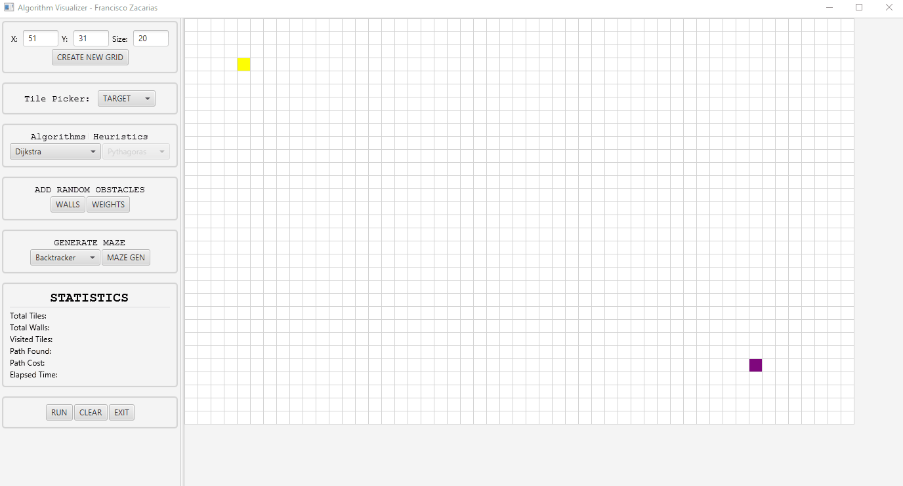
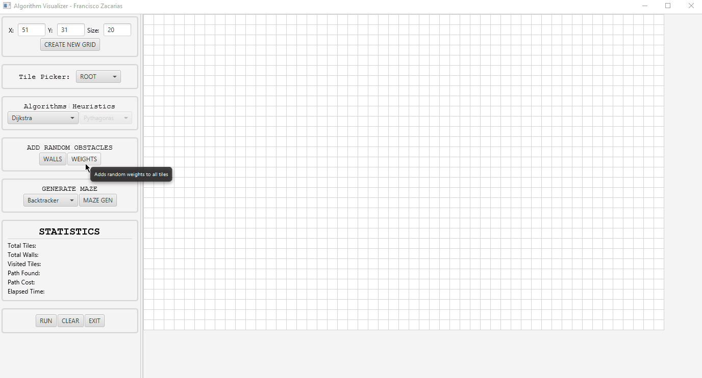
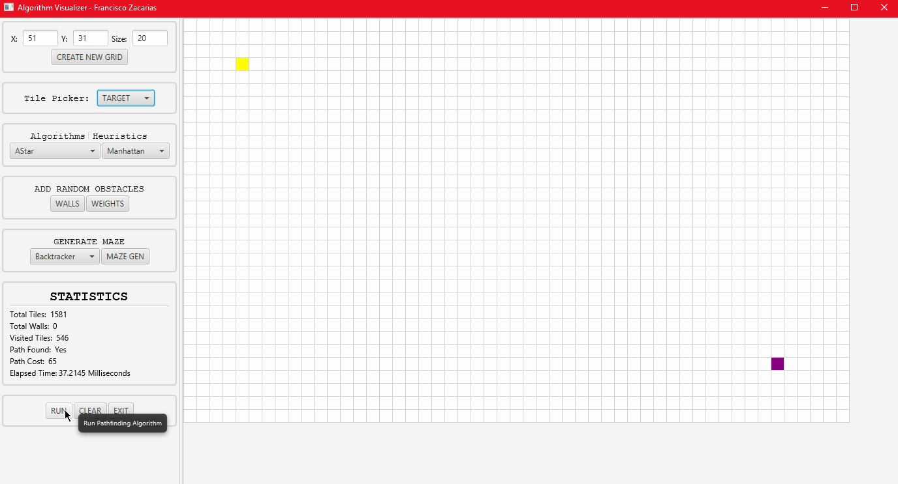
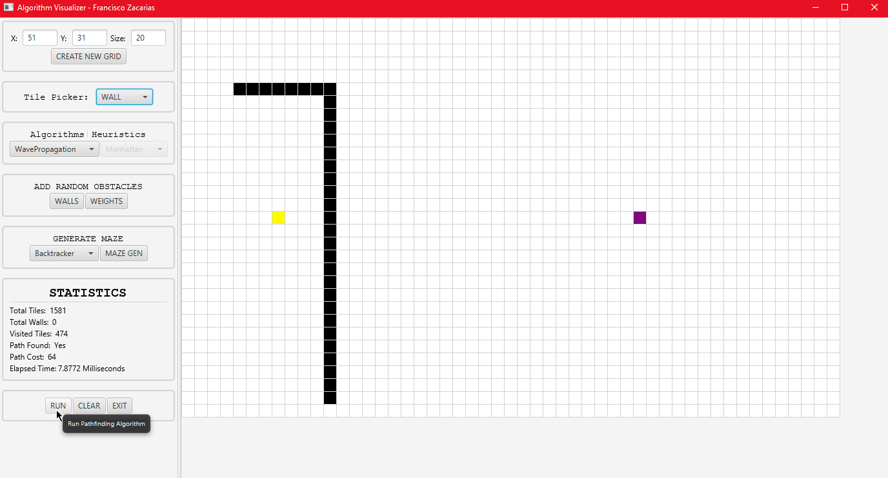

# Algorithm Visualizer

This is a personal project that I created to get some hands on on some cool algorithms I've been learning about recently.
This project contains both pathfinding and maze generation algorithms, and I'll keep updating them as I go.

Here in the app window, where we can see the work environment. It contains a settings panel on the left and a grid where the visualization will occur. As of now, this grid and the algorithms, only support 4 directions (north, south, east, west).

App window

## Features
- Tile picker: Allows user to switch select a specific tile and paint it on the grid E.g. select a root and a target tile, add some walls to the grid, add weights etc..
- Algorithm pickler: Allows the user to pick which pathfinding algorithm he wants to use. It also allows for the user to pick a specific heuristic when using the A* algorithm.
- Add random obstacles: Both of these can fill the grid (randomly) with walls and/or weights ranging from 1 to 12, which makes pathfinding much more interesting.
- Maze generation: Allows the user to pick an algorithm to generate a "random" maze. These algorithms can also be visualized when running.
- Statistics: Includes statistics for each time user presses run. Such statistics can be seen in their respective row in the app.

# Algorithms

## Pathfinding Algorithms
A quick introduction to pathfinding algorithms. All of these algorithms introduce a distinct way to traverse the grid (in this case) and to pathfind from root to the target. Not all of the following algorithms will always return the shortest path nor necessarily work with weights. The following table should clarify this.

| Algorithm       | Supports Weights | Shortest Path Guarantee |
| --------------- | ---------------- | ----------------------- |
| Dijkstra        | True             | True                    |
| A*              | True             | False                   |
| A* Optimal      | True             | True                    |
| WavePropagation | False            | False                   |

Also, keep in mind that I am sure some of these could work with weights and guarantee shortest path, but only represents my implementations.

#### Dijkstra
Dijkstra's shortest path algorithm guarantees the shortest path between two nodes, if it exists.

Dijkstra algorithm running

Dijkstra algorithm running with weighted nodes
#### A* 
The A* algorithm is known for it's optimal efficiency. It works based on a heuristic that tries to estimate the distance between the root and the target node (no heuristic should ever overshoot the actual distance).
I've implemented the A* that stops immediately once it sees the target (which will not necessarily find the shortest path, as it did not visit all the possible nodes) and what I called A*Optimal, which searches all nodes in the grid and guarantees the shortest path.

- Heuristics: This algorithms requires heuristics to run efficiently. For this app (2 dimensional grid), the Manhattan distance is the optimal solution. See [here](https://theory.stanford.edu/~amitp/GameProgramming/Heuristics.html) for how do they work.

A* algorithm running with the Manhattan distance Heuristic

#### Wave Propagation 
It's a much more simple pathfinding algorithm, and I would say not as useful (generally), as it is not the fastest, ignores weights and does not guarantee shortest path.

Wave propagation algorithm running

## Maze Generation Algorithms
#### Recursive Backtracker
This algorithm picks random directions in the grid to go to, as long as they have not been visited yet. If it sees itself stuck, it backtracks itself to the last node with an available neighbor. If no more are available, it backtracks back to the root node and the algorithm is complete.

Recursive backtracker maze generation algorithm
